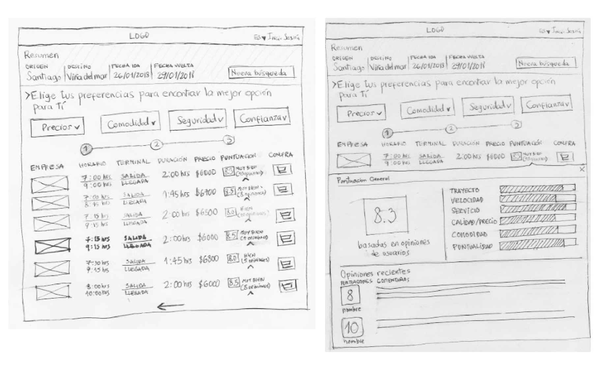

# SAFE TRAVEL

Es una aplicación de venta y reserva de pasajes de autobús de diferentes compañías. Nuestro valor agregado fue entregar una personalización enfocada en la seguridad, confianza y comodidad según el interés del usuario.


## Desarrollado para 
[Flota de buses & Laboratoria](https://marvelapp.com/136jga16/screen/38086057)


## **Proceso de diseño**


## **Objetivo**
```
Mejorar la experiencia actual que vive el usuario al momento de viajar en bus.
```
## **Mi rol dentro del proyecto**
Colabore en conjunto con mi Squad en todo el proyecto en la etapa de investigación, ideación, prototipado y testeo. 

Realicé Research Cuantitativo: Benchmark analizando 6 empresas de buses del país, observando sus sitios web, redes sociales y reclamos. En conjunto aporte en la guía de entrevista y en la encuesta online.

En la etapa de definición e ideación, en equipo realizamos el diagrama de afinidad, customer journey, arquetipos, propuesta de valor y los wireframe.

En la etapa de prototipado en equipo traspasamos los wireframe hechos en papel y de acuerdo a la votación y testeo con usuarios a un prototipo interactivo y de alta fidelidad, el cual fue realizado en marvelapp.

# **Descubrimiento e investigación**
### Research Cualitativo
Se realizó primero observaciones en los siguientes terminales de buses: Pajaritos, Ahumada, San Borja y Santiago. Para descubrir el comportamiento de los usuarios.

* Los pasajeros por lo general se observaban nerviosos a la espera del bus.
* Ansiosos y preocupados por no poseer mayor información y sólo les queda esperar.


Ulteriormente se realizaron entrevistas con el objetivo de descubrir los posibles problemas que se enfrentan los pasajeros durante el proceso de viaje. Querer indagar desde la hora de decidir dónde viajar, al momento de comprar el ticket, llegar al terminal, encontrar el bus, subir al bus y hasta llegar a destino. Para poder conocer mejor las necesidades de nuestros usuarios y resolver sus problemas de manera óptima. 

* Se observó la falta de información de que empresa de buses era más seguro.
* Incumplimiento de horarios en la llegada o en el transcurso del viaje, pérdida de bolsos, seguridad en el transcurso del viaje.

### Research Cuantitativo
**1. Benchmark**
Análisis competitivos y comparativos de los principales empresas de buses de chile, conclusiones, deficiencia en muchos sitios web en el ámbito que no era claro cómo entregaban la información o no se encontraban operativos al momento de querer comprar ticket a diferencia en las redes sociales que si tenía una mayor actualización, responder de inmediato los mensajes, estár al día con la información entregada a los usuarios a diferencia en los sitios web. En las redes sociales, se pudo observar el descontento de muchos pasajeros, por la seguridad de los buses cómo no contaban con los cinturones de seguridad, la comodidad algunos casos no poseían la higiene mínima, horarios que no se cumplen entre otros. 

**2. Encuesta Google**
Se realizaron encuesta para conocer y entender los motivos por qué viaja más las personas, por cuales medios compran los tickets, si se sienten seguros al momento de viajar. 
Con los datos obtenidos concluimos que la mayoría de los usuarios compran presencial los pasajes por seguridad, sienten desconfianza realizarlo en un sitio web. Los usuarios que respondieron que compran su tickets online, no presentaron problemas a comprar a través de internet. Los usuarios tienen frustración al momento de viajar sus  razones, varían desde: escasos boletos por temporada alta, mucha fila, tiempo de espera y operadores que atienden de mala manera, etc.


# **Síntesis y definición**
### Afinity Map - Diagrama de Afinidad
Realizamos en equipo un ejercicio para sintetizar la información, se realizó un brainstorming. Para ordenar las ideas de los problemas que presentan los usuarios, estos datos los obtuvimos gracias a la investigación. Para posteriormente agruparlos según afinidad y similitud creando un Affinity Map.

Se agruparon los problemas en las siguientes categorías: **Seguridad, confort, precios, trayecto, interacción con trabajadores, confianza, formas de compra, puntualidad, frecuencia de buses, acceso y datos extras**.  Nos enfocamos en tres puntos que se repetían más en la problemática: **seguridad, confianza y comodidad.**


### User Personas - Arquetipos
Elaboramos distintos User personas enfocados en los tres puntos más fuertes obtenidos del diagrama de afinidad para comprender más las necesidades de los usuarios al momento de realizar un viaje.


### Customer Journey Map

Utilizamos la herramienta Customer Journey Map para conocer la experiencia y sus etapas al momento de comprar un pasaje online, llegada al terminal, transcurso del viaje y final. Observamos los puntos críticos o frustración de un cliente. Primero al momento de escoger qué compañía se adecua de acuerdo a sus necesidades, obtener la información necesaria para elegir una compañía, llegada al terminal si recibe una atención amable de parte de los auxiliares del bus. Cómo observación debíamos realizar una solución en donde el usuario podría obtener información de diferentes compañías y ver si se adecuaban a las necesidades de seguridad, confianza y comodidad.


Luego de este ejercicio pudimos identificar que el hecho de que el bus no posee las mejores condiciones para viajar produce al usuario frustración e inseguridad en el transcurso del viaje.

### **Ideación**
***
Realizamos como grupo cada una sketches votando por cuál nos parecía más acorde con la problemática que queríamos resolver, Identificamos que era importante tener un buscador de acuerdo a las necesidades del usuario. En el tema de la seguridad si se cumple la velocidad límite por ejemplo, en confianza la puntualidad, comodidad la condición del bus. Todos estos datos se obtendría a través de una encuesta que se realiza al final del viaje. ha base sobre eso cada compañía tendría una puntuación. Los clientes serían usados como los fiscalizadores. 



### **Prototipado**
***
Cómo prototipo final, incluimos en la opción comunicar a un tercero a parte de la persona que se encuentre en el bus, así el otro usuario recibe información del bus sin estar arriba de él, si está por llegar al terminal o si presentó algún problema el viaje. Pensando en los clientes que viajen solo y necesite una atención especial, por ejemplo cuando viajan niños solos en el bus.

<a href="https://marvelapp.com/136jga16/screen/38086057" style="color:pink"> prototipo </a>

### **Colaboradores**
<a href="https://www.linkedin.com/in/mariaagustinavalenti/" style="color:pink">Maria Agustina Valenti</a> | 
<a href="https://www.linkedin.com/in/andrea-p%C3%A9rez-gonz%C3%A1lez/" style="color:pink">Andrea Pérez</a> | <a href="https://www.linkedin.com/in/nataliacancino/" style="color:pink">Natalia Cancino</a> | 
<a href="https://www.linkedin.com/in/jazminmeneses/" style="color:pink">Jazmín Meneses</a> | 
<a href="https://www.linkedin.com/in/sasha-aviles-calder%C3%B3n/" style="color:pink">Sasha Aviles</a>
