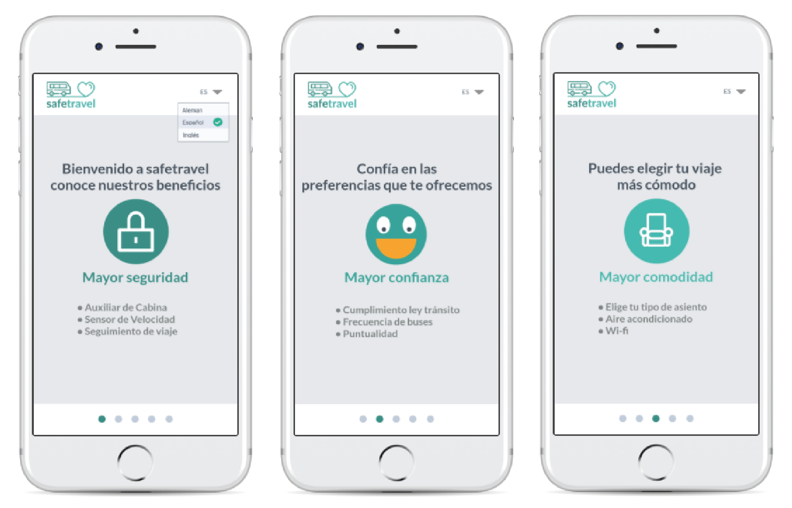

# SAFE TRAVEL

Es una aplicación de venta y reserva de pasajes de autobús de diferentes compañías. Nuestro valor agregado fue entregar una personalización enfocada en la seguridad, confianza y comodidad según el interés del usuario.

## Desarrollado para 
[Laboratoria](https://marvelapp.com/136jga16/screen/38086057)

### **El reto**
***
Nueva experiencia en empresas de buses, descubrir oportunidades para mejorar la experiencia de todos los usuarios de este tipo de transporte: horarios, embarques, desembarques, compra de tickets en los terminales, compra de tickets online, cancelaciones, cambios de pasajes, etc.

### **Mi rol**
***
Colabore en conjunto con mi Squad en todo el proyecto en la etapa de investigación, ideación, prototipado y testeo. 

Realice el Benchmark analizando 6 empresas de buses del país, observando sus sitios web, redes sociales y reclamos. En conjunto aporte en la guía de entrevista y encuesta online.

En la etapa de la ideación, en equipo realizamos el diagrama de afinidad, customer journey, user persona (ANA), wireframe.

En la etapa del prototipo fue en realizado en marvelapp y en equipo.

### **Colaboradores**
***

<a href="https://www.linkedin.com/in/mariaagustinavalenti/" style="color:pink">Maria Agustina Valenti</a> | 
<a href="https://www.linkedin.com/in/andrea-p%C3%A9rez-gonz%C3%A1lez/" style="color:pink">Andrea Pérez</a> | <a href="https://www.linkedin.com/in/nataliacancino/" style="color:pink">Natalia Cancino</a> | 
<a href="https://www.linkedin.com/in/jazminmeneses/" style="color:pink">Jazmín Meneses</a> | 
<a href="https://www.linkedin.com/in/sasha-aviles-calder%C3%B3n/" style="color:pink">Sasha Aviles</a>

### **Descubrimiento e investigación**
***
El equipo se dividió en varias tareas, algunas realizaron el Benchmark, analizamos los sitios web nacionales de empresas de buses, conclusiones que observamos deficiencia en muchos sitios web en el ámbito que no era claro cómo entregaban la información o no se encontraban operativos al momento de querer comprar ticket a diferencia en las redes sociales si tenía una mayor importancia, marcaban presencia al responder de inmediato los mensajes, de estár al día con la comunicación con los clientes a diferencia en los sitios web. En las redes sociales, se pudo observar el descontento de muchos pasajeros, por la seguridad de los buses cómo no contaban con los cinturones de seguridad, la comodidad algunos casos no poseían la higiene minima, horarios que no se cumplian entre otros. 

Las entrevista en los terminales de buses se observó la falta de información de que empresa de buses era más seguro, se observó incumplimiento de horarios en la llegada o en el transcurso del viaje, pérdida de bolsos, seguridad en el transcurso del viaje. Los pasajeros muchos se encontraban nerviosos por el hecho de no saber cómo se iba a presentar el transcurso del viaje, si respetan el límite de velocidad, se presentaba los cinturones de seguridad, entre otras cosas.

La encuesta online que se realizó se difunde en las redes sociales, para obtener datos cuantitativos para la investigación. Con los datos obtenidos se concluye que la mayoría de los usuarios compran presencial los pasajes por seguridad sientes desconfianza realizarlo en un sitio web. Los usuarios que respondieron que compran su tickets online, no presentaron problemas a comprar a través de internet. Los usuarios que compran de manera presencial no tienen buena experiencia, sus  razones, varían desde: escasos boletos por temporada alta, mucha fila, tiempo de espera y operadores que atienden de mala manera, etc.

### **Síntesis y definición**

Realizamos como grupo **Diagrama de afinidad** para ordenar las ideas de los problemas que presentan los usuarios, estos datos los obtuvimos gracias a la investigación. Se agruparon los problemas en las siguientes categorías: **Seguridad, confort, precios, trayecto, interacción con trabajadores, confianza, formas de compra, puntualidad, frecuencia de buses, acceso y datos extras**.  Nos enfocamos en tres puntos que se repetían más en la problemática: **seguridad, confianza y comodidad**.

Elaboramos distintos **User personas** enfocados en los tres puntos más fuertes obtenidos del diagrama de afinidad para comprender más las necesidades de los usuarios al momento de realizar un viaje.

**Experiencia del usuario**

Utilizamos la herramienta Customer Journey Map para conocer la experiencia y sus etapas al momento de comprar un pasaje online, llegada al terminal, transcurso del viaje y final. Observamos los puntos críticos o frustración de un cliente. Primero al momento de escoger qué compañía se adecua de acuerdo a sus necesidades, obtener la información necesaria para elegir una compañía, llegada al terminal si recibe una atención amable de parte de los auxiliares del bus. Cómo observación debíamos realizar una solución en donde el usuario podría obtener información de diferentes compañías y ver si se adecuaban a las necesidades de seguridad, confianza y comodidad.

### **Problem Statement**
***

**{Alejandra}** Necesita encontrar la información constante del viaje en el bus para sentirse más segura, cómoda y comunicárselo a sus seres queridos.

### **How Might We? | ¿Cómo podríamos?**

Ayudar a nuestros usuarios a que obtengan más información sobre seguridad y confort en la experiencia de viajar.

### **What if… | Qué pasaría si…**

Acceso ranking de los buses. 
Que los usuarios puedan ser más específicos en su búsqueda. 
Que los usuarios obtengan notificaciones durante el viaje para compartirlo. 
Que se pueda ver la ubicación de nuestro bus. 

### **StoryTelling**

"Hola soy Alejandra y viajo los fines de semana largos y en vacaciones de verano, uso buses para ir a ver a mi familia y amigos. Mi familia es muy preocupada, en todo momento quiere saber cómo estoy.
Cuando viajo compro mis pasajes por internet y hay veces que me re-venden los pasajes, o el bus no está en buenas condiciones, no me gusta muchas veces la atención de los auxiliares.
Me importa estar segura a bordo, saber que cuando compro un pasaje puedo subir tranquila, saber datos de cual es la mejor opción y si puedo tener beneficios más seguido. Si no me siento cómoda no me dan ganas de viajar y prefiero quedarme en casa.
Si existiera una forma de saber esta información antes de subirme al bus y no descubrirlo a bordo, sería muy importante.
Con la aplicación que están proponiendo, me daría seguridad y confianza en que el trayecto y la compra del pasaje será buena, sin duda aumenta mi frecuencia con la que viajó, Con el seguimiento de trayecto me da seguridad a mi y también le da tranquilidad a mi familia de que llegare bien y descansada"

### **Ideación**
***
Realizamos como grupo cada una sketches votando por cuál nos parecía más acorde con la problemática que queríamos resolver, Identificamos que era importante tener un buscador de acuerdo a las necesidades del usuario. En el tema de la seguridad si se cumple la velocidad límite por ejemplo, en confianza la puntualidad, comodidad la condición del bus. Todos estos datos se obtendría a través de una encuesta que se realiza al final del viaje. ha base sobre eso cada compañía tendría una puntuación. Los clientes serían usados como los fiscalizadores. 

### **Prototipado**
***
Cómo prototipo final, incluimos en la opción comunicar a un tercero a parte de la persona que se encuentre en el bus, así el otro usuario recibe información del bus sin estar arriba de él, si está por llegar al terminal o si presentó algún problema el viaje. Pensando en los clientes que viajen solo y necesite una atención especial, por ejemplo cuando viajan niños solos en el bus.

<a href="https://marvelapp.com/136jga16/screen/38086057" style="color:pink"> prototipo </a>

